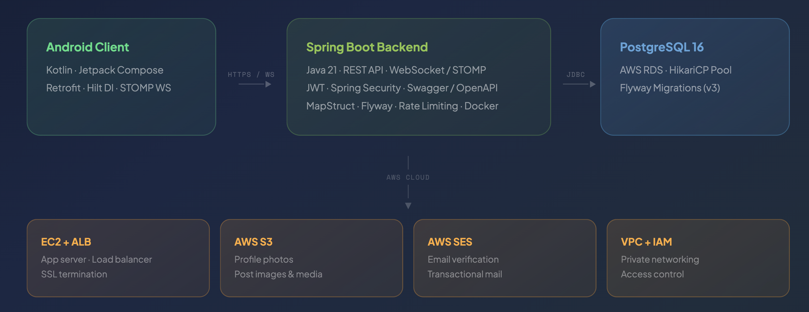
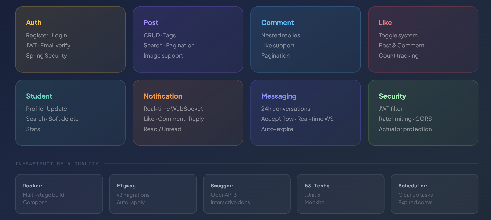

# Beuverse Backend

> A social media platform built exclusively for university students — connecting peers through posts, comments, real-time messaging, and notifications.

---

## Overview

Beuverse is a production-ready REST API and WebSocket backend for a university-focused social media mobile application. Built with **Spring Boot 4**, **Java 21**, and **PostgreSQL**, the backend follows a feature-based architecture with clean separation of concerns across every layer. The system is fully containerized with Docker and designed for deployment on AWS.

The Android client (Kotlin + Jetpack Compose) communicates with the backend over HTTPS for REST calls and WebSocket/STOMP for real-time features such as live notifications and messaging.

---

## System Architecture

The following diagram illustrates the high-level system flow — from the Android client through the Spring Boot backend to PostgreSQL, and the supporting AWS cloud services.



The Android client sends requests over HTTPS for all standard API operations and establishes a persistent WebSocket connection for real-time features. The Spring Boot backend handles authentication, business logic, and data persistence via JDBC to a PostgreSQL database hosted on AWS RDS. Supporting AWS services include S3 for media storage, SES for transactional email, ALB for load balancing, and VPC + IAM for network security and access control.

---

## Feature Modules

The backend is organized into independent feature modules, each owning its own entity, repository, service, mapper, DTO, and controller layers.



| Module | Description |
|---|---|
| **Auth** | Registration, login, email verification, JWT token generation |
| **Post** | Create, read, update, delete posts with tags, images, search, and pagination |
| **Comment** | Nested comment threads with like support and pagination |
| **Like** | Toggle like system for both posts and comments with count tracking |
| **Student** | Profile management, search by username or name, soft delete |
| **Notification** | Real-time WebSocket notifications for likes, comments, and replies |
| **Messaging** | 24-hour limited conversations with accept flow and auto-expiry |
| **Security** | JWT filter, IP-based rate limiting, actuator endpoint protection |

---

## Tech Stack

| Category | Technology |
|---|---|
| **Language** | Java 21 |
| **Framework** | Spring Boot 4.0.3 |
| **Security** | Spring Security 7, JWT (jjwt 0.12.6) |
| **Database** | PostgreSQL 16, Spring Data JPA, Hibernate 7 |
| **Connection Pool** | HikariCP |
| **Migrations** | Flyway 11 |
| **Mapping** | MapStruct 1.6.3 |
| **Real-time** | WebSocket + STOMP |
| **Documentation** | Swagger / OpenAPI 3 (springdoc) |
| **Containerization** | Docker (multi-stage build), Docker Compose |
| **Cloud** | AWS EC2, RDS, S3, SES, ALB, VPC, IAM |
| **Testing** | JUnit 5, Mockito |
| **Build** | Maven |

---

## Project Structure

```
src/main/java/com/altankoc/beuverse_backend/
├── auth/               # Registration, login, email verification
├── comment/            # Comment CRUD, nested replies, likes
├── core/
│   ├── base/           # BaseEntity (id, createdAt, updatedAt, deleted)
│   ├── config/         # JWT properties, WebSocket config, WebMVC config
│   ├── exception/      # Global exception handler, custom exceptions
│   ├── ratelimit/      # IP-based rate limiting interceptor
│   ├── response/       # ErrorResponse, standard API response wrapper
│   ├── scheduler/      # Cleanup tasks, expired conversation removal
│   ├── security/       # JWT service, authentication filter, SecurityUtils
│   └── websocket/      # WebSocket notification service
├── enums/              # Department, Role, PostTag, NotificationType
├── like/               # Toggle like system for posts and comments
├── messaging/          # 24h conversation system with WebSocket
├── notification/       # Real-time notifications via WebSocket
├── post/               # Post CRUD, image support, tags, search
└── student/            # Profile management, search, soft delete
```

---

## API Endpoints

### Auth
| Method | Endpoint | Description |
|---|---|---|
| `POST` | `/api/v1/auth/register` | Register a new student |
| `POST` | `/api/v1/auth/login` | Login and receive JWT token |
| `GET` | `/api/v1/auth/verify-email` | Verify email with token |

### Posts
| Method | Endpoint | Description |
|---|---|---|
| `GET` | `/api/v1/posts` | Get all posts (paginated) |
| `POST` | `/api/v1/posts` | Create a new post |
| `GET` | `/api/v1/posts/{id}` | Get post by ID |
| `PUT` | `/api/v1/posts/{id}` | Update post |
| `DELETE` | `/api/v1/posts/{id}` | Delete post |
| `GET` | `/api/v1/posts/search?keyword=` | Search posts by content |
| `GET` | `/api/v1/posts/tag/{tag}` | Filter posts by tag |
| `GET` | `/api/v1/posts/student/{id}` | Get posts by student |

### Comments
| Method | Endpoint | Description |
|---|---|---|
| `POST` | `/api/v1/comments` | Create comment or reply |
| `GET` | `/api/v1/comments/post/{postId}` | Get comments for a post |
| `GET` | `/api/v1/comments/{id}/replies` | Get nested replies |
| `PUT` | `/api/v1/comments/{id}` | Update comment |
| `DELETE` | `/api/v1/comments/{id}` | Delete comment |

### Likes
| Method | Endpoint | Description |
|---|---|---|
| `POST` | `/api/v1/likes/post/{postId}` | Toggle post like |
| `POST` | `/api/v1/likes/comment/{commentId}` | Toggle comment like |
| `GET` | `/api/v1/likes/post/{postId}` | Check if post is liked |
| `GET` | `/api/v1/likes/student/{id}/posts` | Get liked posts by student |

### Notifications
| Method | Endpoint | Description |
|---|---|---|
| `GET` | `/api/v1/notifications` | Get all notifications |
| `GET` | `/api/v1/notifications/unread-count` | Get unread count |
| `PUT` | `/api/v1/notifications/{id}/read` | Mark as read |
| `PUT` | `/api/v1/notifications/read-all` | Mark all as read |

### Messaging
| Method | Endpoint | Description |
|---|---|---|
| `POST` | `/api/v1/messaging/conversations/{studentId}` | Start a conversation |
| `PUT` | `/api/v1/messaging/conversations/{id}/accept` | Accept conversation |
| `GET` | `/api/v1/messaging/conversations` | Get all conversations |
| `POST` | `/api/v1/messaging/conversations/{id}/messages` | Send a message |
| `GET` | `/api/v1/messaging/conversations/{id}/messages` | Get messages |

---

## Real-time WebSocket

The backend uses Spring WebSocket with STOMP protocol for real-time features. After establishing a connection, clients subscribe to their personal channels:

```
/user/queue/notifications   → incoming notifications
/user/queue/messages        → incoming chat messages
/user/queue/conversations   → conversation status updates
```

**Connection endpoint:** `ws://{host}/ws`

Authentication is handled via JWT token passed in the STOMP `Authorization` header during the `CONNECT` frame.

---

## Database Schema

The database is managed by Flyway with versioned migration scripts:

- **V1** — Core tables: `students`, `posts`, `post_images`, `comments`, `likes`
- **V2** — Notifications: `notifications`
- **V3** — Messaging: `conversations`, `messages`

Key design decisions:
- **Soft delete** on students (30-day retention before hard delete)
- **Hard delete** on posts, comments, and likes for simplicity
- **Cascade delete** on related records (post deleted → comments and likes cascade)
- **Unique constraints** to prevent duplicate likes and duplicate conversations
- **Indexes** on frequently queried columns for performance

---

## Security

- **JWT Authentication** — stateless, token-based auth with 30-day expiry
- **Spring Security** — all endpoints protected except `/api/v1/auth/**`, `/actuator/health`, and Swagger UI
- **Rate Limiting** — IP-based limiter on login and register endpoints (5 requests/minute)
- **Soft Delete Guard** — deleted accounts are blocked at the JWT filter level
- **Actuator Protection** — health endpoint is public, all other actuator endpoints require `ADMIN` role

---

## Running Locally

### Prerequisites
- Java 21
- Docker & Docker Compose

### With Docker Compose

```bash
# Clone the repository
git clone https://github.com/altankocdev/beuverse-backend.git
cd beuverse-backend

# Create .env file
cp .env.example .env
# Edit .env with your values

# Start the application
docker compose up --build
```

The API will be available at `http://localhost:8080`.

### Without Docker

```bash
# Requires a running PostgreSQL instance
# Set active profile to dev
./mvnw spring-boot:run -Dspring-boot.run.profiles=dev
```

### Environment Variables

| Variable | Description |
|---|---|
| `DB_URL` | PostgreSQL JDBC URL |
| `DB_USERNAME` | Database username |
| `DB_PASSWORD` | Database password |
| `JWT_SECRET` | JWT signing secret (min 32 chars) |
| `MAIL_HOST` | SMTP host |
| `MAIL_USERNAME` | SMTP username |
| `MAIL_PASSWORD` | SMTP password |

---

## Testing

The project includes **53 unit tests** covering all service layers:

```bash
./mvnw test
```

| Test Class | Coverage |
|---|---|
| `AuthServiceImplTest` | Register, login, email verify |
| `PostServiceImplTest` | Create, read, update, delete, search |
| `CommentServiceImplTest` | Create, update, delete, nested replies |
| `LikeServiceImplTest` | Toggle post like, toggle comment like |
| `NotificationServiceImplTest` | Create, mark as read, unread count |
| `MessagingServiceImplTest` | Start, accept, send, expire, delete |

---

## API Documentation

Interactive Swagger UI is available at:

```
http://localhost:8080/swagger-ui/index.html
```

---

## Deployment

The application is designed for AWS deployment:

1. **EC2** — Run the Docker container
2. **RDS** — Managed PostgreSQL database
3. **S3** — Profile photos and post media
4. **SES** — Email verification
5. **ALB** — Load balancer with SSL termination
6. **VPC + IAM** — Network isolation and access control

Production configuration is handled via environment variables — no secrets in source code.

---

## Related

- **Android Client** → [beuverse-android](https://github.com/altankocdev/beuverse)

---

## Author

**Altan Koç** — Software Engineer
[GitHub](https://github.com/altankocdev)
